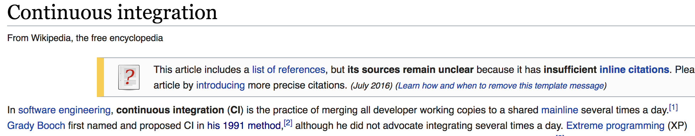
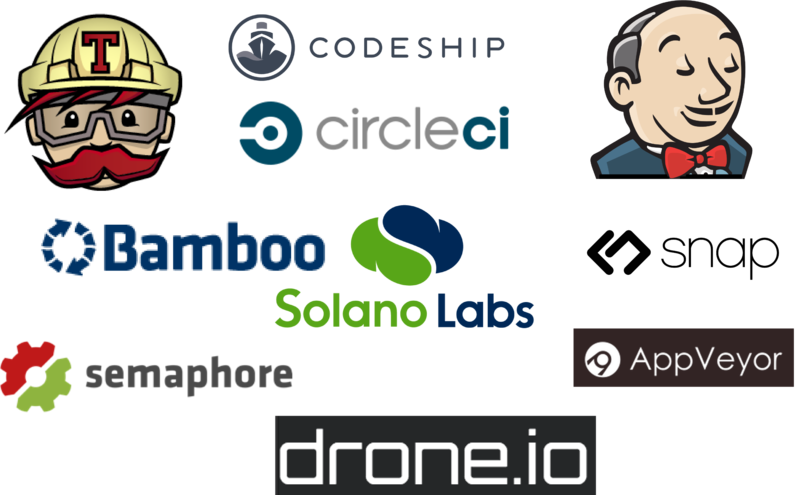
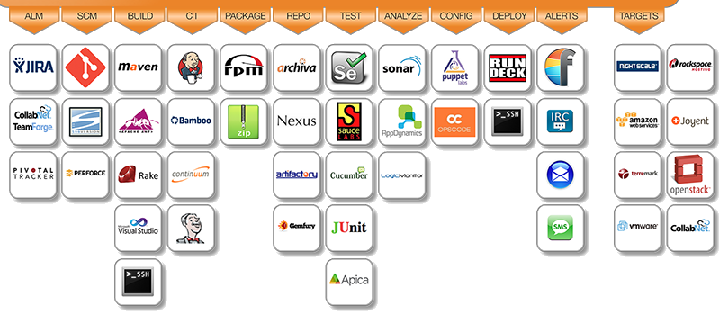
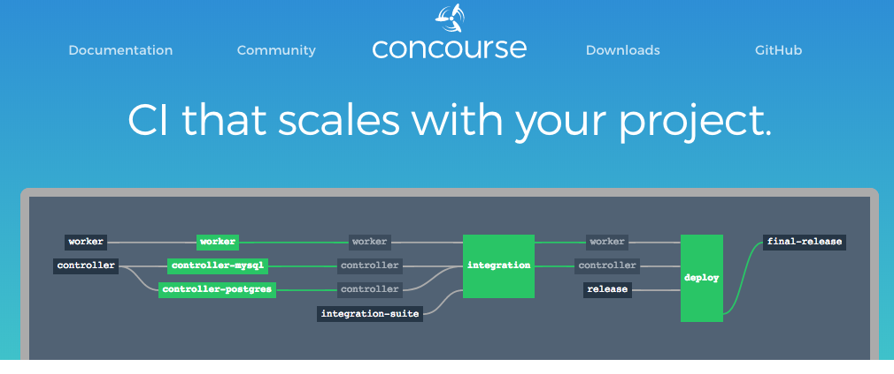
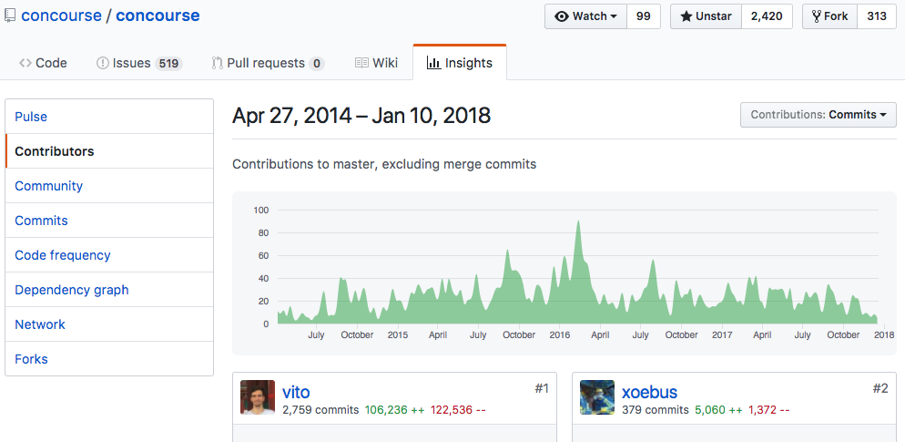
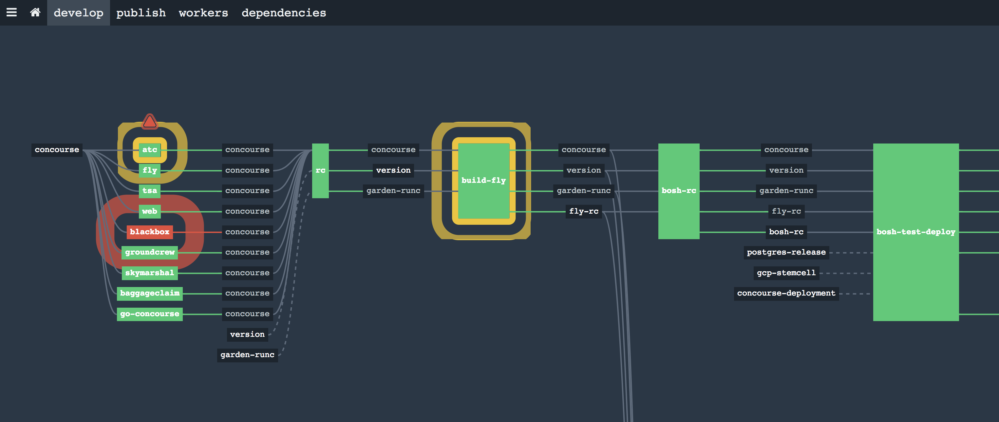

<!-- .slide: data-background="img/background-orange-orig.jpg" -->

## Introduction

---
<!-- .slide: data-background="img/background-orange-orig.jpg" -->

## About Me

github.com/rms1000watt

---
<!-- .slide: data-background="img/background-orange-orig.jpg" -->

## Continuous Integration

Wikipedia definition of Continous Integration

---
<!-- .slide: data-background="img/background-orange-orig.jpg" -->

## Continuous Integration

Some steps involved with Continuous Integration

---
<!-- .slide: data-background="img/background-orange-orig.jpg" -->

## Existing Tools

There are a handful of CI tools out there in the market

---
<!-- .slide: data-background="img/background-orange-orig.jpg" -->

## Ecosystem

And these tools need to integrate with the existing IT/Software ecosystem

---
<!-- .slide: data-background="img/background-orange-orig.jpg" -->

## Problem

It's a complex universe for DevOps to integrate all the things

---
<!-- .slide: data-background="img/background-orange-orig.jpg" -->

## Solution

Simplicity

---
<!-- .slide: data-background="img/background-orange-orig.jpg" -->

## Concourse CI

Concourse is built with simplicity in mind (https://concourse.ci)

---
<!-- .slide: data-background="img/background-orange-orig.jpg" -->

## Concourse CI

Concourse CI has a good open source community (https://github.com/concourse/concourse)

---
<!-- .slide: data-background="img/background-orange-orig.jpg" -->

## Concourse CI

Concourse eats their own dog food (https://ci.concourse.ci)
