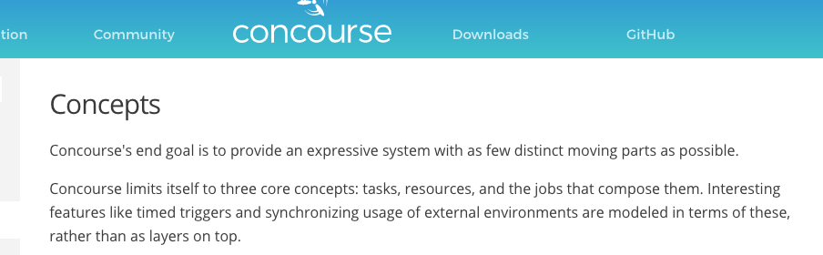
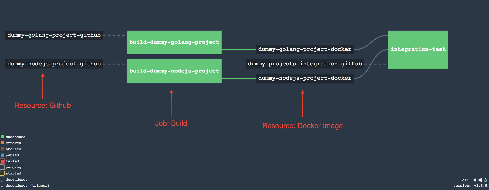
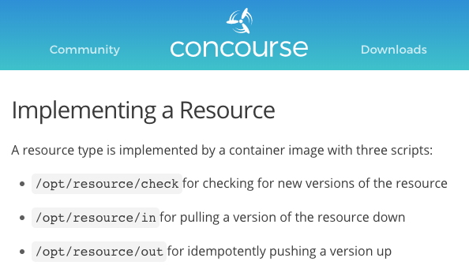
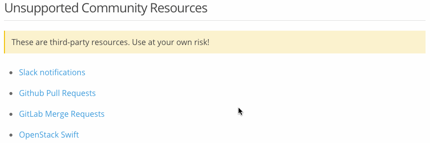

<!-- .slide: data-background="img/background-lightgreen-orig.jpg" -->

## Concepts

- Task     <!-- .element: class="fragment" --> 
- Resource <!-- .element: class="fragment" --> 
- Job      <!-- .element: class="fragment" --> 

--- 
<!-- .slide: data-background="img/background-lightgreen-orig.jpg" -->

## Official Docs

http://concourse.ci/concepts.html

--- 
<!-- .slide: data-background="img/background-lightgreen-orig.jpg" -->

## Pipeline

- Collection of Jobs
- First class citizen

--- 
<!-- .slide: data-background="img/background-lightgreen-orig.jpg" data-transition="slide-in none" -->

## Pipeline Decomposed

--- 
<!-- .slide: data-background="img/background-lightgreen-orig.jpg" data-transition="none" -->

## Pipeline Decomposed

--- 
<!-- .slide: data-background="img/background-lightgreen-orig.jpg" data-transition="none" -->

## Pipeline Decomposed

--- 
<!-- .slide: data-background="img/background-lightgreen-orig.jpg" data-transition="none" -->

## Pipeline Decomposed

---
<!-- .slide: data-background="img/background-lightgreen-orig.jpg" -->

## Interfaces

Think Golang Interfaces

(https://concourse.ci/implementing-resources.html)

---
<!-- .slide: data-background="img/background-lightgreen-orig.jpg" -->

## Official Resources

<ul style="width:30%; float:center;">
  <li>git</li>
  <li>hg</li>
  <li>time</li>
  <li>s3</li>
  <li>archive</li>
  <li>semver</li>
  <li>github-release</li>
</ul>

<ul style="width:30%; float:center;">
  <li>docker-image</li>
  <li>tracker</li>
  <li>pool</li>
  <li>test</li>
  <li>cf</li>
  <li>bosh-io-release</li>
  <li>bosh-io-stemcell</li>
</ul>

(http://concourse.ci/resource-types.html)

---
<!-- .slide: data-background="img/background-lightgreen-orig.jpg" -->

## Community Resources

(http://concourse.ci/resource-types.html)
